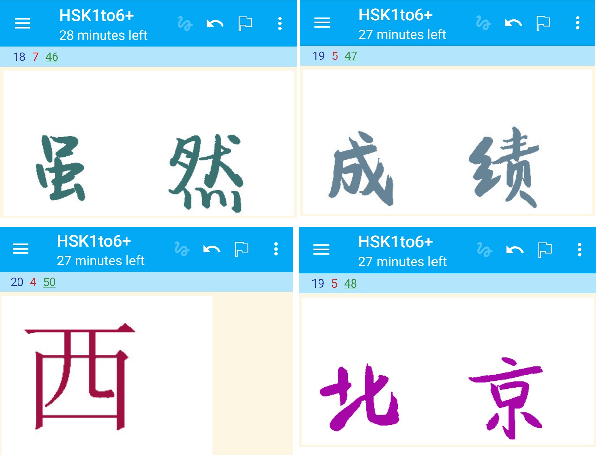

# Anki style transfer for Chinese characters

## Overview

This is a personal project of mine and I upload it to github mainly as backup. You are free to use it but it is not user friendly.

This Anki addon generates random Chinese fonts from a selection of font files and a generative adversarial network taken from: https://github.com/kaonashi-tyc/zi2zi

The motivation is the following:

Your should not learn vocabulary relying on the association with the font/size/style of the character, because your brain will then connect two unrelated concept to each other. You should rather learn the 'essence' of the character. My proposal to enforce learning the essence of characters is by changing the style of character every time you see it. Another bonus is that every charater is something 'new', increasing the surprise effect and thus making it more fun to study. In this way you learn like a good Machine Learning algorithm that has a diverse dataset and is optimized to generalize, not overfit.

Originally my plan was to randomize the font of a given Anki card every time the card is drawn. However, I currently lack the time and knowledge to fully implement it this way, mainly because it is rather difficult to include external python packages such as tensorflow to the Anki environment.
However, my script still works, but it needs to be run manually.

## Instructions (Windows 10)

- As I said, this addon is not ready for the end user. So the instructions are rather for myself. However, maybe experienced Anki users can do something with it.

- Download this repository as zip and unzip it in the Anki addons directory
- Open the config.json and enter your username and the names of the decks. These should be decks where the character is the front card. The entry "field_no" denotes the field number where the character of the front side is defined. This is usually 0. If not sure, then open Anki -> Browse -> Select your deck -> Click on a card. Below should be several fields. If the front is defined in the first field, then this corresponds to field_no "0", if it's defined in the second field, then it's field_no "1" and so on.

The attribute "random_color" determines whether color is also randomized or not. If "interpolate" is true, then different styles are interpolated, if "non_AI_generated" is true, then some of the characters will be generated using non AI fonts and if "AI_generated" is true, then some of the characters are generated by AI.
If "full_deck" is set to true, it will generated non AI characters for the entire deck. This takes some time! After generating characters for the entire deck it's better to set this option to "false", because then characters are generated for scheduled cards only. 
- I used Python 3.7. In order to run this script quite a lot of libraries are needed. The libraries are listed in environment.yml.
- Run:
> python init.py
- This takes a few seconds/minutes depending on the number of decks and scheduled cards. Afterwards, the generated characters are saved in the database.
- Open Anki -> Browse -> Select your deck -> Cards...
- Paste the following code into the Front Template:
> \
- Replace "Front" by the correct field key and DECKNAME by the name of the Deck.
- When synchronizing with the Anki cloud the generated characters will also be available for Anki droid.
- Run the python script again to generate

